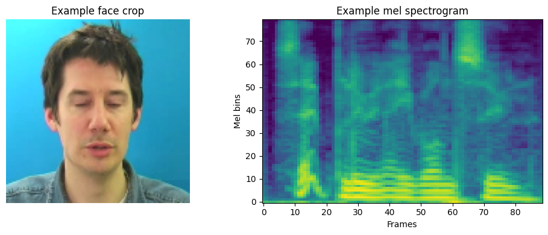
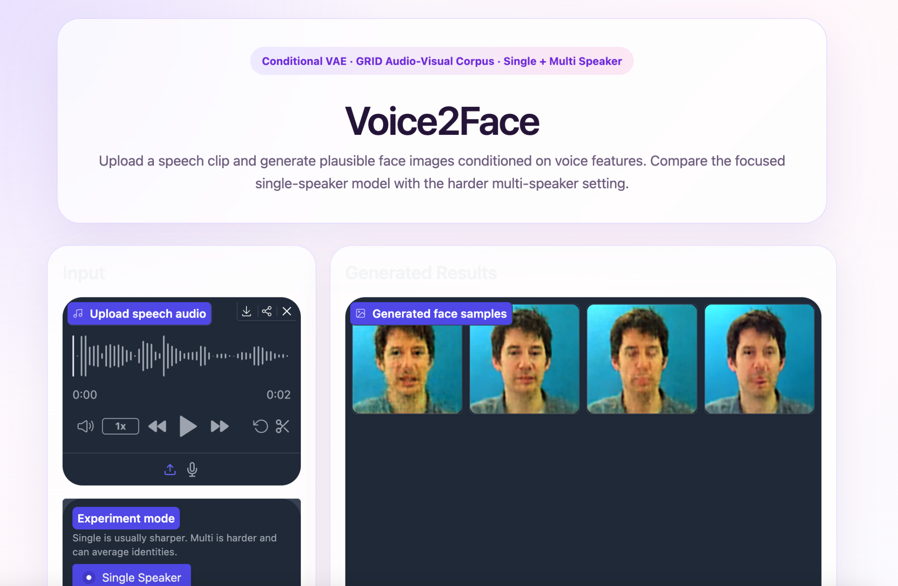
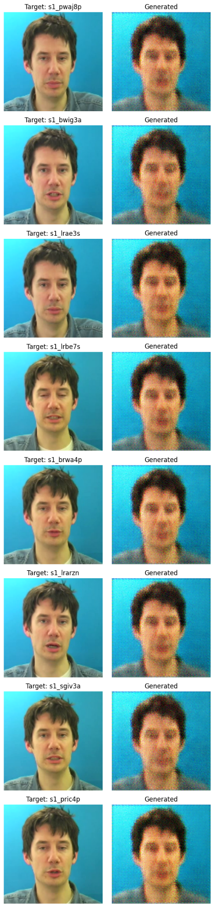
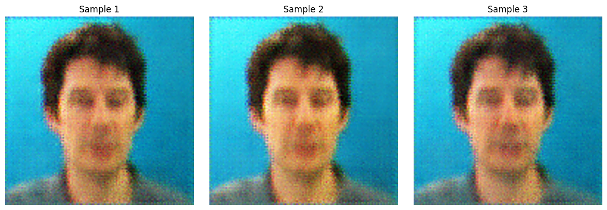
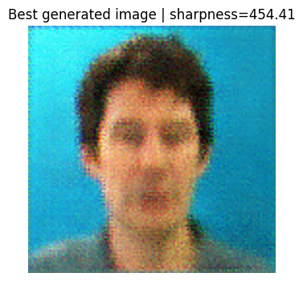
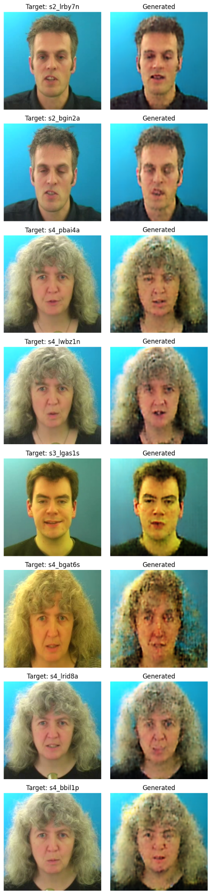
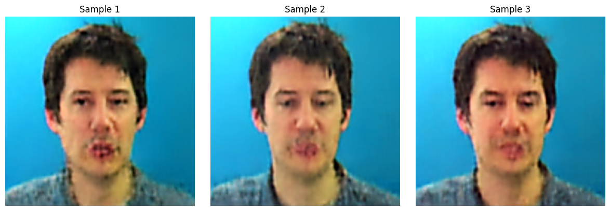
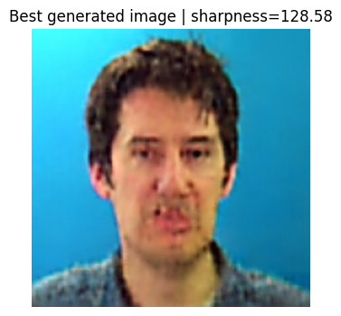

# Voice2Face: Generating Face Images from Speech

Voice2Face is an audio-to-image generation project that generates plausible face images from speech. The system takes a speech clip, converts it into a mel-spectrogram, and uses a Conditional Variational Autoencoder (CVAE) to generate a face image conditioned on the audio features.

This project includes both:

- **Single-speaker generation:** a simpler setting where the model learns from one speaker and produces more stable outputs.
- **Multi-speaker generation:** a harder setting where the model learns across multiple identities and speech patterns.

My original proposal was based on VoxCeleb-1, but the accessible version only provided metadata/split files instead of directly usable media. To keep the project runnable and reproducible, I used the **GRID audio-visual corpus**, which provides aligned speech audio and face video.

---

## Project Overview

The goal of this project is to test whether speech contains enough useful information for a model to generate a plausible face-like image.

The full pipeline includes:

1. Loading GRID audio-visual data.
2. Extracting face frames from video.
3. Converting speech audio into mel-spectrograms.
4. Training a Conditional Variational Autoencoder.
5. Running inference from audio only.
6. Comparing single-speaker and multi-speaker generation.
7. Providing an interactive Gradio UI for testing the model.

The model is not intended to reconstruct the exact real identity of a speaker. Instead, it generates a plausible face-like image conditioned on the learned voice representation.

---

## Model Architecture

The model is a **Conditional Variational Autoencoder (CVAE)**.

It has three main components:

### 1. Audio Encoder

The audio encoder converts the mel-spectrogram into a compact voice embedding.

```text
Speech audio → Mel-spectrogram → Audio embedding
```

### 2. Image Encoder

During training, the image encoder maps the target face image into a latent representation.

```text
Face image → Latent face representation
```

### 3. Face Decoder

The decoder combines the latent vector with the audio embedding and generates the output face image.

```text
Latent vector + Audio embedding → Generated face image
```

This makes the model conditional because the generated image depends on the input speech features.

---

## Dataset

This project uses the **GRID audio-visual corpus**.

The dataset provides:

- Speaker videos
- Corresponding speech audio
- Aligned audio-visual samples

For preprocessing, I extracted:

- Face frames from video
- Audio from each sample
- Mel-spectrograms from audio
- Paired audio-face training examples

Example preprocessing output:



---

## Installation

Clone the repository:

```bash
git clone https://github.com/Tavishi-Kaushik/Video_To_Face_GenAI.git
cd Video_To_Face_GenAI
cd Final_Submission_Audio_To_Face_Generation
```

Create and activate a virtual environment:

```bash
python3 -m venv .venv
source .venv/bin/activate
```

Install dependencies:

```bash
pip install -r requirements.txt
```

If `requirements.txt` is not available, install the main dependencies manually:

```bash
pip install torch torchvision numpy opencv-python librosa soundfile pillow pyyaml matplotlib tqdm gradio
```

---

## Project Structure

```text
Final_Submission_Audio_To_Face_Generation/
├── app.py
├── single_speaker.yaml
├── multi_speaker.yaml
├── Voice2Face_pipeline_notebook.ipynb
├── data/
├── outputs/
│   ├── final_samples_single_nb/
│   ├── final_samples_multi_nb/
│   ├── samples_single/
│   ├── samples_multi/
│   ├── readme_single_speaker_ui.png
│   ├── readme_single_target_vs_generated.png
│   ├── readme_single_generated_samples.png
│   ├── readme_multi_target_vs_generated.png
│   └── readme_multi_generated_samples.png
└── README.md
```

---

## How to Run the Notebook

Open the notebook:

```bash
jupyter notebook "Voice2Face_pipeline_notebook.ipynb"
```

Then run the cells in order.

The notebook includes:

1. Dataset loading
2. Audio preprocessing
3. Face-frame preprocessing
4. Model definition
5. Training
6. Inference
7. Single-speaker and multi-speaker result visualization

---

## How to Run the UI

The project includes a Gradio interface for interactive inference.

Run:

```bash
python3 app.py
```

Then open the local URL shown in the terminal:

```text
http://127.0.0.1:7860
```

The UI supports:

- Audio upload
- Microphone recording
- Single-speaker mode
- Multi-speaker mode
- Multiple generated samples
- Model/checkpoint display

---

## UI Demonstration

The Gradio UI provides a clean way to test the trained model without manually running notebook cells.



---

## Results

The model successfully generates recognizable face-like images from speech input. The outputs are not photorealistic and are sometimes blurry, which is expected for a VAE-based image generation model. However, the generated samples clearly resemble human faces and show that the model learned a meaningful audio-conditioned visual representation.

---

### Single-Speaker Results

The single-speaker model produces more stable outputs because it only needs to model one identity distribution.

#### Single-Speaker Target vs Generated



#### Multiple Single-Speaker Samples from Audio

The CVAE can sample different latent vectors for the same audio input, producing multiple possible face outputs.



#### Best Single-Speaker Generated Output



---

### Multi-Speaker Results

The multi-speaker model is harder because it must learn across several identities. The generated images are still face-like, but they can appear more averaged or less sharp because the model has to represent a broader identity space.

#### Multi-Speaker Target vs Generated



#### Multiple Multi-Speaker Samples from Audio



#### Best Multi-Speaker Generated Output



---

## Single-Speaker vs Multi-Speaker Comparison

| Mode | Description | Observed Result |
|---|---|---|
| Single Speaker | Trained on one speaker | More stable and consistent generated faces |
| Multi Speaker | Trained on multiple speakers | Harder setting; outputs are more varied and sometimes blurrier |
| Both Modes | Use speech-conditioned generation | Both generate recognizable face-like outputs |

The single-speaker model performs better because the identity space is smaller. The multi-speaker model has to learn both speech variation and identity variation, which makes generation more difficult.

---

## Extra Criteria Pursued

I pursued the following extra criteria:

### 1. GUI

I implemented an interactive **Gradio UI** in `app.py`.

The UI supports both single-speaker and multi-speaker inference. It allows the user to upload or record speech audio, choose the experiment mode, generate multiple face samples, and view model/checkpoint details.

This makes the project easier to test and demonstrate.

### 2. Latent Space / Generative Sampling

The CVAE uses a latent vector during generation. This allows the model to generate multiple different face outputs from the same speech input.

This is shown in the generated sample grids, where the same audio input produces several different generated faces.

### 3. Config-Based Experiment Tracking

The project uses separate YAML configuration files for the two experiments:

```text
single_speaker.yaml
multi_speaker.yaml
```

The UI loads the correct configuration and checkpoint depending on the selected mode.

---

## Difficulties Faced and How I Solved Them

### 1. Dataset Issue

My original proposal used VoxCeleb-1, but the accessible version only contained metadata and split information rather than directly usable media files.

**Solution:**  
I switched to the GRID audio-visual corpus because it provides aligned audio and video data, which is suitable for audio-to-face generation.

---

### 2. Audio and Video Pairing

The model needs paired audio and face images. This required converting raw video/audio files into training-ready examples.

**Solution:**  
I built a preprocessing pipeline that extracts audio, creates mel-spectrograms, extracts face frames, and pairs them for training.

---

### 3. Blurry Generated Images

The generated faces are not perfectly sharp.

**Solution:**  
This is expected for a VAE-based model because VAEs learn a smooth probabilistic latent space. I focused on generating recognizable face-like structure rather than photorealistic reconstruction.

---

### 4. Multi-Speaker Generation Was Harder

The multi-speaker model has to learn across different identities, facial structures, and audio patterns.

**Solution:**  
I trained and evaluated single-speaker and multi-speaker versions separately. This made it possible to compare the easier and harder versions of the task clearly.

---

### 5. UI and Checkpoint Compatibility

While building the Gradio UI, the inference code needed to match the architecture used by the saved checkpoints.

**Solution:**  
I adjusted the UI inference code so that it loads the correct YAML file and checkpoint for the selected experiment mode.

---

## How to Reproduce Results

### Single-Speaker Inference

```bash
python3 app.py
```

Then select:

```text
Single Speaker
```

Upload or record an audio clip and click:

```text
Generate Face Images
```

### Multi-Speaker Inference

```bash
python3 app.py
```

Then select:

```text
Multi Speaker
```

Upload or record an audio clip and click:

```text
Generate Face Images
```

---

## Requirements

Main libraries used:

```text
torch
torchvision
numpy
opencv-python
librosa
soundfile
pillow
pyyaml
matplotlib
tqdm
gradio
```

---

## Final Notes

This project implements an end-to-end audio-to-face generation pipeline.

The final system includes:

- Dataset preprocessing
- Mel-spectrogram extraction
- CVAE-based face generation
- Single-speaker and multi-speaker experiments
- Generated face-like outputs
- A clean Gradio UI
- Config-based experiment selection
- Result visualizations in the notebook and output folders

The generated images are not perfectly sharp, but they are recognizable as face images. This satisfies the core image-generation requirement while also demonstrating an interactive GUI and generative latent-space sampling.
